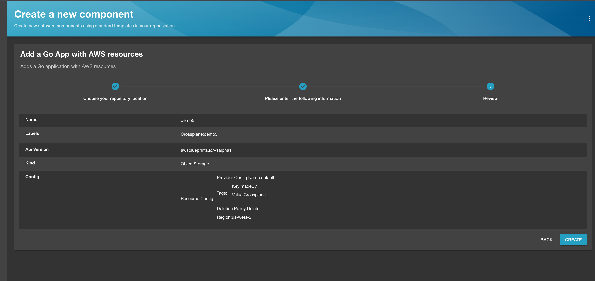
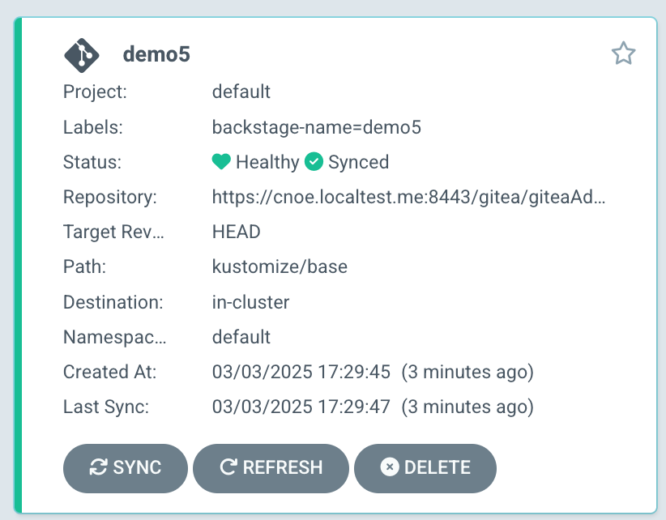
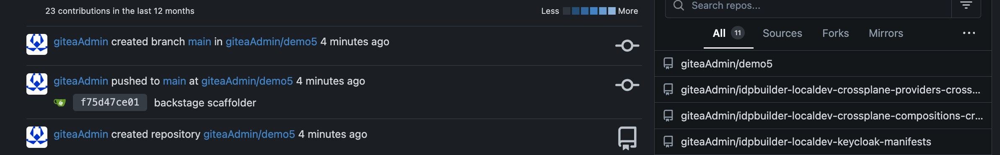

# Crossplane Integrations for Backstage

`idpBuilder` is extensible to launch custom Crossplane patterns using package extensions. 

Please use the below command to deploy an IDP reference implementation with an Argo application for preparing up the setup for terraform integrations:

```bash
idpbuilder create \
  --use-path-routing \
  --package https://github.com/cnoe-io/stacks//ref-implementation \
  --package https://github.com/cnoe-io/stacks//crossplane-integrations
```
## What is installed?

1. Crossplane Runtime
1. AWS providers
1. Basic Compositions

This needs your credentials for this to work. Follow the Crossplane installation documentation on how to add your credentials.

## Application with cloud resources.

With this integration, we can deploy an application with cloud resources using Backstage templates from the reference implementation, together with Crossplane integrations. Before doing so the credentials file needs to updated and applied to the cluster to allows Crossplane to deploy cloud resources on your behalf. If you do not currently have an IAM user with permisions to deploy resources follow these [instructions](https://docs.aws.amazon.com/IAM/latest/UserGuide/id_users.html) to create one and apply the proper permissions. for testing purposes the admin permisions should be sufficient. 
To do so you need to update [the credentials secret file](crossplane-providers/provider-secret.yaml), then apply the updated file to the cluster using:
`kubectl apply -f provider-secret.yaml`

In this example, we will create an application with a S3 Bucket.

Choose a template named `App with S3 bucket`, type `demo3` as the name, then choose a region to create this bucket in.

Once you click the create button, you will have a very similar setup as the basic example.
The only difference is we now have a resource for a S3 Bucket which is managed by Crossplane.
<!-- All of the images from the folder -->
Here is an example of how to create the demo app


Here is an example of what the demo app will look like when created in ArgoCD


Here is an example of what the demo app will look like when created in Gitea


Here is an example of what the demo app S3 Bucket will look like when created


## Note
In this example, we used Crossplane to provision resources, but you can use other cloud resource management tools such as Terraform instead.

Regardless of your tool choice, concepts are the same. We use Backstage as the templating mechanism and UI for users, then use Kubernetes API with GitOps to deploy resources.